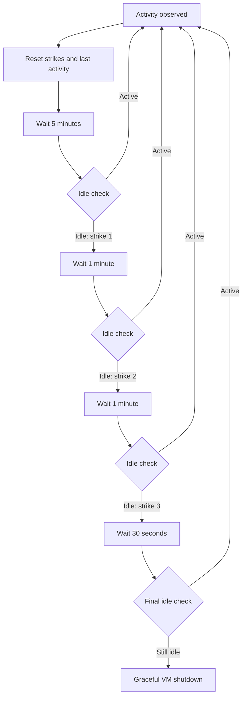

# SSH VM service

## Architecture

Elhone is the HTTP service. Barbirolli owns the VM state.

# Elhone: HTTP boundary

The name comes from [Harry MacElhone](https://en.wikipedia.org/wiki/Harry_MacElhone). He was a
bartender in early-twentieth-century New York.

- `axum` with an `Arc<Barbirolli>`.
- `ELHONE_ADDR`. The default address is `127.0.0.1:3000`.
- Returns JSON for all responses except the raw VM log stream. Error responses use
  `{"error": "..."}`.
- VMs cause a `404` response. Invalid state changes and full VM capacity cause a `409`
  response. Invalid input causes a `422` response. Internal lifecycle failures cause a `500`
  response.
- serializes operations that change the same VM.

## OCI image lifecycle

Elhone owns the OCI image index in its application state:

```rust
struct AppState {
    manager: Barbirolli,
    standard_rootfs: Rootfs,
    oci_store: OciStore,
}
```

`OciStore` contains one lifecycle for each composite `(name, tag)` key. Each entry contains the
pulled rootfs artifact. While the image runs, the entry also contains the ID of its single
Barbirolli VM. Elhone maps each OCI image reference to its artifact and VM lifecycle. Barbirolli
owns the VM state and runtime resources.

Each OCI command name contains a colon. The colon defines a CLI namespace. It does not define an
authorization scope or a Cargo feature:

- `x oci:pull alpine:latest` pulls the image and stores it.
- `x oci:run alpine:latest` pulls a missing image. Then it creates and starts the VM.
- `x oci:stop alpine:latest` stops the applicable VM and keeps the pulled artifact.
- `x oci:rm alpine:latest` rejects a running entry. After the VM stops, the command removes the
  entry and its artifacts.

Thus, each `name:tag` uses this sequence: `absent -> pulled -> running -> pulled -> absent`.
This specification does not define HTTP routes or JSON wire formats for these operations.

## DELETE `/vms/:id`

```http
DELETE /vms/:id
```

The route shuts down the VM and cleans its runtime resources. It then saves the deletion marker
and returns `204 No Content`. Elhone deregisters the VM only after shutdown and cleanup are
successful.

## GET `/vms`

```http
GET /vms
```

```json
[
  {
    "id": 0,
    "status": "running",
    "bindings": [{ "internal": 22, "external": 2222 }],
    "network": {
      "vm_id": 0,
      "tap": "fc-tap0",
      "subnet": "172.16.0.0",
      "host_ip": "172.16.0.1",
      "guest_ip": "172.16.0.2",
      "guest_mac": "06:00:ac:10:00:02"
    }
  }
]
```

The route returns the state, port bindings, and allocated network of each registered VM. Status
and list responses show these stable states:

- `discovered`: The VM is stored and stopped.
- `running`: Firecracker actively manages the VM.
- `failed`: The VM startup, shutdown, or runtime cleanup failed.

The daemon logs contain the `starting` and `shutting_down` transition events. Elhone serializes
operations that change the same VM. Thus, API readers see the resultant stable state.

## GET `/vms/:id`

```http
GET /vms/:id
```

The route returns the state, port bindings, and allocated network of one registered VM.

## GET `/vms/:id/logs`

```http
GET /vms/:id/logs?follow=false
```

The route returns the append-only serial stdout as `application/octet-stream`.

With the default `follow=false`, not following the serial console.

## GET `/vms/:id/status`

```http
GET /vms/:id/status
```

```json
{ "id": 0, "status": "discovered" }
```

## POST `/vms/:id/start`

```http
POST /vms/:id/start
```

## POST `/vms/:id/shutdown`

```http
POST /vms/:id/shutdown
```

## POST `/vms`

```http
POST /vms

{
  "vcpu_count": 2,
  "authorized_keys": ["ssh-ed25519 ..."],
  "bindings": [{ "internal": 22, "external": 2222 }]
}
```

The route creates a stopped/discovered VM.

- Returns `201 Created` with the VM ID.
- Service copies the kernel and rootfs artifacts from `IMAGE_ROOT`.
- Daemon selects the memory size. The default size
  is 256 MiB.
- Service stores this value in `VmSpec`. Ports are `u16` values in the range
  `1..=65535`.
- Binding `{ "internal": 22, "external": 2222 }` publishes host TCP port `2222` to
  guest port `22`.

The daemon assigns `default_vm_mem` (256 MiB) to each new VM. It stores this value in the VM
specification. Provisioning uses integer division for these calculations:

- `mem_mib` (1,706 MiB) = `max_daemon_mem` (2,048 MiB) * 100 / (100 + `extra_percentage` (20)).
- `count` (6) = `mem_mib` (1,706 MiB) / `default_vm_mem` (256 MiB).
- `initial_balloon_mem` (57 MiB) = (`max_daemon_mem` (2,048 MiB) - `mem_mib` (1,706 MiB)) /
  `count` (6).

Firecracker deflates the balloon on OOM. It collects balloon statistics every 10 seconds.

Before Barbirolli creates a VM, it counts the running VMs. It permits creation while this total is
less than the configured `count`.

# Barbirolli: VM and host-resource boundary

The name comes from [Sir John Barbirolli](https://en.wikipedia.org/wiki/John_Barbirolli). He was a
British conductor associated with [The Hallé](https://en.wikipedia.org/wiki/The_Hall%C3%A9).

- `fctools`.
- `nlink`.
- `validated`.
- Persistence, the Firecracker lifecycle, and VM networking.
- Supports a matching Firecracker 1.13 and jailer toolchain on x86_64 Linux and aarch64 Linux.
  In jailed mode, `FIRECRACKER` and `JAILER` specify root-owned, non-writable executables.
- Firecracker uses an attached `JailedVmmExecutor` by default. The jailer chroots the VMM and
  drops it to a stable per-VM UID/GID without daemonizing or creating PID/network namespaces.
  `FIRECRACKER_EXECUTOR=unrestricted` is the explicit development fallback.
- Each running VM has one cgroup v2 directory for health and idle sampling.

```rust
struct Barbirolli {
    vms: DashMap<VmId, BarbirolliVm>,
    store: VmStore,
    firecracker: Firecracker,
    balloon: RwLock<Balloon>,
    provisioning: ProvisioningConfig,
    shutdown_timeout: Duration,
    draining: AtomicBool,
    idle_policy: IdlePolicy,
}

struct Firecracker {
    bin: PathBuf,
    executor: FirecrackerExecutorConfig,
    api_socket_timeout: Duration,
}

struct DaemonConfig {
    provisioning: ProvisioningConfig,
    firecracker: PathBuf,
    firecracker_executor: FirecrackerExecutorConfig,
    entrypoint: PathBuf,
    idle_policy: Option<IdlePolicy>,
}

enum FirecrackerExecutorConfig {
    Jailed(JailerConfig),
    Unrestricted,
}

struct JailerConfig {
    jailer: PathBuf,
    chroot_base: PathBuf,
    uid_base: u32,
    gid_base: u32,
}

struct ProvisioningConfig {
    default_vm_mem: MemoryMib,
    max_daemon_mem: MemoryMib,
    initial_balloon_mem: MemoryMib,
    count: u32,
    extra_percentage: u8,
}

enum BarbirolliVm {
    /// Persisted and stopped. Owns no runtime resources.
    Discovered(VmSpec),
    /// Persisted after the last lifecycle operation failed.
    Failed(VmSpec),
    /// Running, or retaining resources after a failed cleanup.
    Managed(ManagedVm),
}

/// Owns the resources of a running VM.
struct ManagedVm {
    spec: VmSpec,
    vm: FirecrackerVm,
    network: Option<ManagedNetwork>,
    pid: i32,
    cgroup: Option<VmCgroup>,
    metrics_task: JoinHandle<()>,
    latest_metrics: Arc<RwLock<Option<Metrics>>>,
    monitor: Mutex<Option<Monitor>>,
    failed: bool,
}
```

## VM types and state

```rust
type Result<T, E = LifecycleError> = std::result::Result<T, E>;

/// Parsed in the range 0..16384 and persisted in config.json.
struct VmId(u16);

struct VmSpec {
    id: VmId,
    /// The persisted default is false.
    deleted: bool,
    artifact_dir: PathBuf,
    kernel: PathBuf,
    rootfs: Rootfs,
    vcpu_count: VcpuCount,
    api_socket: ApiSocket,
    memory_mib: MemoryMib,
    bindings: Vec<PortBinding>,
    network: NetworkSpec,
}

type FirecrackerResourceSystem = fctools::vm::ResourceSystem<...>;
type FirecrackerVm = fctools::vm::Vm<...>;

#[derive(Serialize, Deserialize)]
struct VmInput {
    /// Injected by the daemon and not accepted by the HTTP API.
    rootfs: Rootfs,
    vcpu_count: VcpuCount, // 1..=31
    authorized_keys: Vec<AuthorizedKey>,
    bindings: Vec<PortBinding>,
}

/// A private ext4 filesystem that can be mounted to plant authorized keys.
struct Rootfs(PathBuf);

struct PortBinding {
    internal: Port,
    external: Port,
}

struct ApiSocket(PathBuf);

enum LifecycleError {
    InvalidInput,
    NotFound,
    Draining,
    CapacityReached { running_vms: usize, max_running_vms: u32 },
    InvalidTransition,
    Storage,
    Network,
    Firecracker,
    StartupRollback,
    CleanupFailures,
}
```

## Persistence

Each `$VM_ROOT/<vm_id>` contains:

- `vmlinux`: The daemon copies this file from `IMAGE_ROOT/vmlinux`.
- `rootfs.ext4`: This file is a private writable copy of `VmInput.rootfs`. The daemon uses
  `IMAGE_ROOT/ubuntu-24.04.ext4` for `POST /vms`.
- `config.json`: This file contains the versioned `VmSpec`.
- `serial.log`: This file contains append-only Firecracker stdout from each VM start. The daemon
  does not truncate or rotate it.
- `firecracker.socket`: The logical API-socket path retained in `VmSpec`. In jailed mode, the
  transient socket is created as `/run/firecracker.socket` inside the VM jail so its host-side
  effective path stays below Unix's socket-path limit.

- `VM_ROOT` contains the VM directories. `IMAGE_ROOT` contains the fixed source artifacts.
- Each stored `VmSpec` owns the logical `$VM_ROOT/<vm_id>/firecracker.socket` path. The executor
  selects and resolves the runtime socket path; cleanup removes both logical and effective paths.
- A VM gets a `VmId` equal to the number of stored VM directories. The first ID is `0`. Deleted VM
  directories stay in this count. Thus, IDs always increase and stay assigned to their
  directories.
- The daemon writes the supplied `authorized_keys` directly to `/root/.ssh/authorized_keys` in the
  private ext4 filesystem. It sets `0700` on `.ssh` and `0600` on the file.
- An empty `authorized_keys` request preserves the default key embedded in the source image.
- `scripts/daemon:setup` installs that default key while preparing
  `IMAGE_ROOT/ubuntu-24.04.ext4`.

## Host and guest networking

```rust

fn default_host_interface() -> Result<InterfaceName>;

struct NetworkSpec {
    vm_id: VmId,
    tap_name: InterfaceName,
    subnet: Ipv4Addr,
    host_ip: Ipv4Addr,
    guest_ip: Ipv4Addr,
    guest_mac: String,
}

enum FirewallRule {
    Dnat { external_port: Port, guest_ip: Ipv4Addr, internal_port: Port },
    DropVmToVm,
    AllowVmEgress,
    AllowEstablishedToVm,
    AllowPublishedTcp { guest_ip: Ipv4Addr, internal_port: Port },
    DropUnpublishedInbound,
    MasqueradeVmSubnet,
}

impl NetworkSpec {
    fn install_nftables_rules(
        &self,
        conn: &Connection<Nftables>,
        host: &InterfaceName,
        table: &str,
        bindings: &[PortBinding],
    ) -> Result<()>;

    fn prepare_managed_network(
        &self,
        bindings: &[PortBinding],
    ) -> Result<PreparedNetwork> {
        let nft_table = format!("fc_vm_{}", self.vm_id);
        // Create the TAP, enable forwarding, and install the per-VM nftables table.
    }
}

struct InterfaceName(String);

impl TryFrom<&str> for InterfaceName {
    type Error = NetworkError;

    fn try_from(s: &str) -> Result<Self> {
        let is_valid = !s.is_empty()
            && s.len() <= 15
            && s
                .bytes()
                .all(|byte| byte.is_ascii_alphanumeric() || b"_.-".contains(&byte));
        if is_valid {
            Ok(s.into())
        } else {
            Err(NetworkError::InvalidInterface(s.to_owned()))
        }
    }
}
```

- The `172.16.0.0/16` pool supplies 2^14 `/30` networks. Each network has a network address, host
  address, guest address, and broadcast address.
- The address pool must not overlap the existing host routes.
- The service selects the external interface from the lowest-metric IPv4 default route in the main
  routing table.
- Each binding publishes TCP from the selected external interface to the VM guest address. It lets
  peer VMs connect directly to the same internal TCP port.
- The firewall permits only established replies and published ports from the host or a peer VM to
  enter a VM TAP.
- Each VM owns an independent table with an `accept` base-chain policy. A final rule for the output
  TAP applies the VM inbound allowlist. The rule also lets the firewall evaluate the other VM
  tables.
- DNAT applies to packets from outside `172.16.0.0/16`. The source-pool condition prevents more
  than one VM table from translating a packet.
- Peer VMs can connect to published ports. The firewall also permits internet egress packets.
- IPv4 forwarding is shared host state. Per-VM cleanup does not disable it.
- The service adds the guest static IP, gateway, and DNS configuration before boot.

```rust
impl VmNetworkSpec {
    fn new(vm_id: VmId) -> Result<Self> {
        let tap_name = format!("fc-tap{vm_id}");
        let offset = vm_id * 4;
        let x = (offset / 256) as u8;
        let y = (offset % 256) as u8;
        let z = y + 2;

        Ok(VmNetworkSpec {
            vm_id,
            tap_name: InterfaceName::try_from(tap_name.as_str())?,
            subnet: 172.16.x.y.,
            host_ip: 172.16.x.(y + 1),
            guest_ip: 172.16.x.z,
            guest_mac: 06:00:ac:10:{x:02x}:{z:02x},
        })
    }

    fn subnet_cidr(&self) -> SString;
}
```

## Lifecycle and reconciliation

### Creation

The creation operation provisions a stopped VM.

```rust
async fn create(&self, input: VmInput) -> Result<VmId> {
    self.is_app_alive()?;
    let running_vms = self
        .vms
        .iter()
        .filter(|vm| matches!(vm.value(), BarbirolliVm::Managed(vm) if !vm.failed))
        .count();
    if running_vms >= self.provisioning.count as usize {
        return Err(CapacityReached {
            running_vms,
            max_running_vms: self.provisioning.count,
        });
    }
    let spec = self
        .store
        .create(input, self.provisioning.default_vm_mem)
        .await?;
    let id = spec.id;
    self.vms.insert(id, BarbirolliVm::Discovered(spec));
    Ok(id)
}
```

### Starting a VM

A start operation uses the `Discovered -> (Managed | Failed)` transition. For a `Failed` VM,
Barbirolli first reconciles stale resources. Then it tries the same transition again.

```rust
async fn start(&mut self, barbirolli: &Barbirolli) -> Result<()> {
    barbirolli.is_app_alive()?;
    let spec = match self {
        Self::Discovered(spec) => spec.clone(),
        Self::Failed(spec) => {
            spec.reconcile(barbirolli).await?;
            spec.clone()
        }
        Self::Managed(vm) if vm.failed => return Err(InvalidTransition),
        Self::Managed(_) => return Ok(()),
    };

    match ManagedVm::start(spec.clone(), barbirolli).await {
        Ok(managed) => {
            *self = Self::Managed(managed);
            Ok(())
        }
        Err(error) => {
            *self = Self::Failed(spec);
            Err(error)
        }
    }
}
```

The start sequence is:

1. Derives the stable UID/GID as the configured bases plus `VmId`.
2. Prepares the TAP with the jailed UID as owner, plus routes, addresses, forwarding, and nftables.
3. Creates `/sys/fs/cgroup/barbirolli/vm-<id>` and enables its controllers.
4. Builds the Firecracker resources and attached jailer configuration. The jailer receives that
   existing cgroup as `--parent-cgroup` and cgroup v2 as `--cgroup-version`.
5. The jailer chroots Firecracker, drops UID/GID, joins the cgroup, and opens the effective API
   socket while retaining the child pipes.
6. Takes the Firecracker pipes. It appends stdout to `serial.log`, drains stderr, and
   keeps stdin.
7. Reads the PID from `cgroup.procs`; Barbirolli does not move the jailed PID a second time. The
   unrestricted fallback discovers the PID and performs the single explicit cgroup move.
8. Starts the metrics reader at the executor's effective FIFO path.
9. `ManagedVm` takes ownership of the live resources.

```rust
async fn ManagedVm::start(spec: VmSpec, barbirolli: &Barbirolli) -> Result<Self> {
    let identity = barbirolli.firecracker.identity(spec.id);
    let network = spec.network.prepare(&spec.bindings, identity.map(|id| id.uid)).await?;
    let cgroup = VmCgroup::create(spec.id)?;
    let mut vm = spec.prepare_vm(barbirolli).await
        .map_err(|error| rollback_cgroup_and_network(error, &cgroup, &network))?;
    let metrics_path = vm.resolve_effective_path(spec.metrics_path());

    vm.start(barbirolli.firecracker.api_socket_timeout).await
        .map_err(|error| rollback_all(error, &mut vm, &cgroup, &network))?;

    let serial_console = SerialConsole::new(&mut vm, spec.id, spec.serial_log()).await
        .map_err(|error| rollback_all(error, &mut vm, &cgroup, &network))?;

    let pid = match barbirolli.firecracker.executor {
        FirecrackerExecutorConfig::Jailed(_) => cgroup.pid()?,
        FirecrackerExecutorConfig::Unrestricted => {
            let pid = find_firecracker_pid(barbirolli, &spec).await?;
            cgroup.attach(pid)?;
            pid
        }
    };

    let metrics = Arc::new(RwLock::new(None));

    Ok(Self {
        pid,
        spec,
        vm,
        failed: false,
        monitor: Mutex::new(None),
        network: Some(network),
        cgroup: Some(cgroup),
        metrics_task: spawn_metrics_reader(metrics_path, metrics.clone()),
        metrics,
        serial_console,
    })
}
```

- Barbirolli creates the cgroup leaf before invoking jailer. Jailer is the only component that places
  a jailed process into it.
- If a failure occurs after network preparation, startup rollback releases the VM/jail, network,
  and cgroup. The returned error retains all rollback failures.

### Shutting down a VM

Shutdown releases the runtime resources but keeps the stored VM. A successful shutdown always ends
in `Discovered(VmSpec)`.

```rust
async fn shutdown(&mut self, barbirolli: &Barbirolli) -> Result<()> {
    match self {
        Self::Discovered(_) => Ok(()),
        Self::Failed(spec) => {
            spec.reconcile(barbirolli).await?;
            *self = Self::Discovered(spec.clone());
            Ok(())
        }
        Self::Managed(managed) => {
            let shutdown = managed.shutdown(barbirolli.shutdown_timeout).await;
            let cleanup = managed.cleanup().await;

            match (shutdown, cleanup) {
                (Ok(()), Ok(())) => {
                    *self = Self::Discovered(managed.spec.clone());
                    Ok(())
                }
                (shutdown, cleanup) => {
                    managed.failed = true;
                    Err(ShutdownCleanup { shutdown, cleanup })
                }
            }
        }
    }
}
```

- On x86_64, `ManagedVm::shutdown` sends Ctrl-Alt-Del.
- On aarch64, it writes `reboot\n` through the stored serial stdin.
- After a timeout, it first uses pause-and-kill and then kill.
- Removes the Firecracker resources and jail, network, and cgroup.
- Cleanup flushes the serial stdout writer and stops the metrics reader and tries each resource and combines the errors.

### Deletion

Deletion uses the normal shutdown path. It writes `deleted: true` to `config.json`. Then it removes
the VM from the in-memory map. The VM directory stays on disk and keeps its ID.

```rust
async fn delete(&self, vm_id: VmId) -> Result<()> {
    self.is_app_alive()?;
    let mut vm = self.vms.entry(vm_id).occupied_or(NotFound)?;

    vm.get_mut().shutdown(self).await?;
    self.store.delete(vm.get().spec())?;
    vm.remove();

    Ok(())
}
```

### Warmup and recovery

At startup, Barbirolli reads each versioned configuration. After a successful reconciliation, it
registers each active VM as `Discovered`.

- Reconciliation is required at startup.
- Deleted VMs are part of ID allocation.
- Warmup leaves each registered VM in `Discovered`.

```rust
/// At application startup, kill the stale cgroup and remove stale process resources.
/// This includes the jail, effective socket/FIFO, nftables rules, and cgroup.
async fn reconcile(&self, barbirolli: &Barbirolli) -> Result<()> {
    Validated::from(self.cleanup_stale_cgroup_and_metrics(barbirolli))
        .map4(
            Validated::from(self.network.cleanup_stale().await),
            Validated::from(self.remove_stale_api_sockets(barbirolli)),
            Validated::from(barbirolli.firecracker.cleanup_jail(self)),
            |(), (), (), ()| (),
        )
        .into_result()
}
```

### Application shutdown

Application shutdown sets `draining`. It then shuts down each registered VM.

- After all shutdown attempts, it returns the combined possible failures.

## Idle detection and automatic shutdown

Barbirolli samples each running VM at the Firecracker boundary.

- The VM cgroup supplies CPU, memory, and process use. The Firecracker metrics FIFO supplies the
  network and disk byte counters.
- Conntrack entries for the guest IP supply the connection state.
- Barbirolli reports memory as a health metric.

These conditions show activity:

- CPU use above its configured threshold
- network traffic, disk traffic, or a process-count change
- an established TCP connection

Each condition resets the idle timer.

```text
cpu_percent =
    100 * delta_usage_usec
        / (interval_usec * vcpu_count)

cpu_threshold =
    idle_high + 0.2 * (active_low - idle_high)
```

The default `idle_high` is `0.5%`, and the default `active_low` is `3.0%`. With these values, the
threshold is `1.0%`.



- `IDLE_INITIAL_INTERVAL_SECONDS`,
  `IDLE_STRIKE_INTERVAL_SECONDS`, `IDLE_FINAL_INTERVAL_SECONDS`, `IDLE_CPU_HIGH_PERCENT`, and
  `IDLE_CPU_LOW_PERCENT` sets up the config.
- `FIRECRACKER_EXECUTOR` defaults to `jailed`. Jailed mode requires `JAILER`,
  `JAILER_UID_BASE`, and `JAILER_GID_BASE`; `JAILER_CHROOT_BASE` defaults to
  `/srv/jailer/barbirolli`. Each base must be in `1..=4294950911` so every `VmId` has a non-root,
  non-sentinel identity.
- The first sample sets a new baseline. A lower counter also sets a new
  baseline.

## Testing

The test system uses `cargo-mutants`, unit tests for agents, and integration tests.

```rust
#[firecracker_test]
fn bla_test() {}
```

Each test that queries the Firecracker API uses this macro from `barbirolli_derive`.
`RUN_ON_LIMA` prepares the complete test environment. Then it runs the selected test again inside
Lima.
