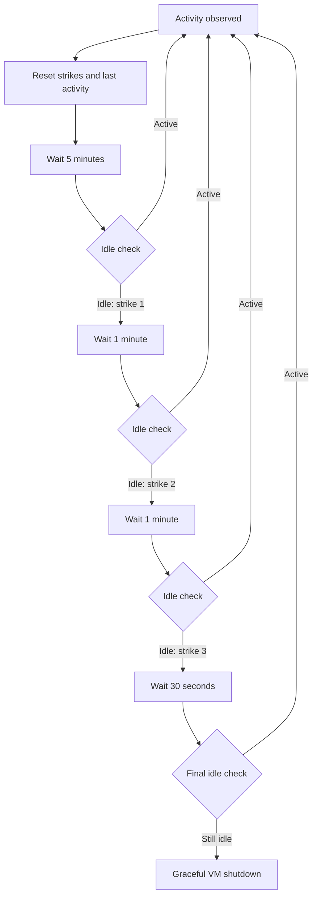

# SSH VM service

## Architecture

Elhone is the HTTP service and Barbirolli is the owner of VM state.

# Elhone: HTTP boundary

Named after [Harry MacElhone](https://en.wikipedia.org/wiki/Harry_MacElhone), a bartender in
early-twentieth-century New York.

- Built with `axum` around an `Arc<Barbirolli>`.
- Binds to `ELHONE_ADDR`, defaulting to `127.0.0.1:3000`.
- JSON responses, including `{"error": "..."}` for errors.
- Unknown VMs return `404`, invalid state transitions and exhausted VM capacity return `409`,
  invalid input returns `422`, and internal lifecycle failures return `500`.
- Mutating operations on the same VM are serialized.

## OCI image lifecycle

Elhone owns the OCI image index in its application state:

```rust
struct AppState {
    manager: Barbirolli,
    standard_rootfs: Rootfs,
    oci_store: OciStore,
}
```

`OciStore` contains one lifecycle for each composite `(name, tag)` key. An entry contains the
pulled rootfs artifact and, while that image is running, the ID of its single Barbirolli VM.
Elhone owns the mapping from an OCI image reference to its artifact and VM lifecycle; Barbirolli
continues to own VM state and runtime resources.

The colon is part of each OCI command name; these names are CLI namespacing, not authorization
scopes or Cargo features:

- `x oci:pull alpine:latest` ensures the image is pulled and stored.
- `x oci:run alpine:latest` automatically pulls an absent entry, then creates and starts its VM.
- `x oci:stop alpine:latest` stops the associated VM while retaining the pulled artifact.
- `x oci:rm alpine:latest` rejects a running entry; once stopped, it removes the entry and its
  artifacts.

Each `name:tag` therefore follows `absent → pulled → running → pulled → absent`.
HTTP routes and JSON wire shapes for these operations are not specified here.

## DELETE `/vms/:id`

```http
DELETE /vms/:id
```

Shuts down the VM, cleans its runtime resources, persists the deletion marker, and returns
`204 No Content`. The deletion marker and deregistration occur after successful shutdown and
cleanup.

## GET `/vms`

```http
GET /vms
```

```json
[
  {
    "id": 0,
    "status": "running",
    "bindings": [{ "internal": 22, "external": 2222 }],
    "network": {
      "vm_id": 0,
      "tap": "fc-tap0",
      "subnet": "172.16.0.0",
      "host_ip": "172.16.0.1",
      "guest_ip": "172.16.0.2",
      "guest_mac": "06:00:ac:10:00:02"
    }
  }
]
```

Returns the state, port bindings, and allocated network of every registered VM. Status and list
responses expose these stable states:

- `discovered`: the VM is persisted and stopped.
- `running`: the VM is actively managed by Firecracker.
- `failed`: VM startup, shutdown, or runtime cleanup failed.

`starting` and `shutting_down` are transition events emitted in daemon logs. Mutating operations
on the same VM are serialized, so API readers observe the resulting stable state.

## GET `/vms/:id`

```http
GET /vms/:id
```

Returns the state, port bindings, and allocated network of one registered VM.

## GET `/vms/:id/status`

```http
GET /vms/:id/status
```

```json
{ "id": 0, "status": "discovered" }
```

## POST `/vms/:id/start`

```http
POST /vms/:id/start
```

Starts a discovered VM. The operation is idempotent for a running VM.

## POST `/vms/:id/shutdown`

```http
POST /vms/:id/shutdown
```

Gracefully shuts down a managed VM and cleans its runtime resources. The operation is idempotent
for a discovered VM.

## POST `/vms`

```http
POST /vms

{
  "vcpu_count": 2,
  "authorized_keys": ["ssh-ed25519 ..."],
  "bindings": [{ "internal": 22, "external": 2222 }]
}
```

Creates a stopped VM and returns `201 Created` with its ID. The request contains `vcpu_count`,
`authorized_keys`, and `bindings`; the service copies the kernel and rootfs artifacts from
`IMAGE_ROOT`. The daemon's provisioning configuration selects memory (256 MiB by default), which
is persisted in `VmSpec`. Ports are `u16` values in the range `1..=65535`. A binding
`{ "internal": 22, "external": 2222 }` publishes host TCP port `2222` as guest port `22`.

Every new VM is assigned the daemon's `default_vm_mem` (256 MiB), and that value is persisted in
the VM specification. Provisioning uses integer division for these calculations:

- `mem_mib` (1,706 MiB) = `max_daemon_mem` (2,048 MiB) * 100 / (100 + `extra_percentage` (20)).
- `count` (6) = `mem_mib` (1,706 MiB) / `default_vm_mem` (256 MiB).
- `initial_balloon_mem` (57 MiB) = (`max_daemon_mem` (2,048 MiB) - `mem_mib` (1,706 MiB)) /
  `count` (6).

Firecracker deflates the balloon on guest out-of-memory conditions and collects balloon
statistics every 10 seconds.

Before creating a VM, Barbirolli counts the currently running VMs. It admits creation while that
total is below the configured `count`.

# Barbirolli: VM and host-resource boundary

Named after [Sir John Barbirolli](https://en.wikipedia.org/wiki/John_Barbirolli), the British
conductor associated with [The Hallé](https://en.wikipedia.org/wiki/The_Hall%C3%A9).

- `fctools`
- `nlink`
- `validated`
- Barbirolli owns persistence, the Firecracker lifecycle, and VM networking.
- Barbirolli supports Firecracker 1.13 on x86_64 and aarch64 Linux; `FIRECRACKER` names its
  executable.
- Firecracker runs through `UnrestrictedVmmExecutor`.
- Each running VM has one cgroup v2 directory for health and idle sampling.

```rust
struct Barbirolli {
    vms: DashMap<VmId, BarbirolliVm>,
    store: VmStore,
    firecracker: Firecracker,
    balloon: RwLock<Balloon>,
    provisioning: ProvisioningConfig,
    shutdown_timeout: Duration,
    draining: AtomicBool,
    idle_policy: IdlePolicy,
}

struct Firecracker {
    bin: PathBuf,
    api_socket_timeout: Duration,
}

struct DaemonConfig {
    provisioning: ProvisioningConfig,
    firecracker: PathBuf,
    idle_policy: Option<IdlePolicy>,
}

struct ProvisioningConfig {
    default_vm_mem: MemoryMib,
    max_daemon_mem: MemoryMib,
    initial_balloon_mem: MemoryMib,
    count: u32,
    extra_percentage: u8,
}

enum BarbirolliVm {
    /// Persisted and stopped. Owns no runtime resources.
    Discovered(VmSpec),
    /// Persisted after the last lifecycle operation failed.
    Failed(VmSpec),
    /// Running, or retaining resources after a failed cleanup.
    Managed(ManagedVm),
}

/// Owns the resources of a running VM.
struct ManagedVm {
    spec: VmSpec,
    vm: FirecrackerVm,
    network: Option<ManagedNetwork>,
    pid: i32,
    cgroup: Option<VmCgroup>,
    metrics_task: JoinHandle<()>,
    latest_metrics: Arc<RwLock<Option<Metrics>>>,
    monitor: Mutex<Option<Monitor>>,
    failed: bool,
}
```

## VM types and state

```rust
type Result<T, E = LifecycleError> = std::result::Result<T, E>;

/// Parsed in the range 0..16384 and persisted in config.json.
struct VmId(u16);

struct VmSpec {
    id: VmId,
    /// The persisted default is false.
    deleted: bool,
    artifact_dir: PathBuf,
    kernel: PathBuf,
    rootfs: Rootfs,
    vcpu_count: VcpuCount,
    api_socket: ApiSocket,
    memory_mib: MemoryMib,
    bindings: Vec<PortBinding>,
    network: NetworkSpec,
}

type FirecrackerResourceSystem = fctools::vm::ResourceSystem<...>;
type FirecrackerVm = fctools::vm::Vm<...>;

#[derive(Serialize, Deserialize)]
struct VmInput {
    /// Injected by the daemon and not accepted by the HTTP API.
    rootfs: Rootfs,
    vcpu_count: VcpuCount, // 1..=31
    authorized_keys: Vec<AuthorizedKey>,
    bindings: Vec<PortBinding>,
}

/// A private ext4 filesystem that can be mounted to plant authorized keys.
struct Rootfs(PathBuf);

struct PortBinding {
    internal: Port,
    external: Port,
}

struct ApiSocket(PathBuf);

enum LifecycleError {
    InvalidInput,
    NotFound,
    Draining,
    CapacityReached { running_vms: usize, max_running_vms: u32 },
    InvalidTransition,
    Storage,
    Network,
    Firecracker,
    StartupRollback,
    CleanupFailures,
}
```

## Persistence

Each `$VM_ROOT/<vm_id>` contains:

- `vmlinux`: copied from `IMAGE_ROOT/vmlinux`.
- `rootfs.ext4`: private writable copy of `VmInput.rootfs`; the daemon injects
  `IMAGE_ROOT/ubuntu-24.04.ext4` for `POST /vms`.
- `config.json`: versioned `VmSpec`.

- `VM_ROOT` holds VM directories and `IMAGE_ROOT` holds the fixed source artifacts.
- Every persisted `VmSpec` owns its unique Firecracker API socket path under
  `$VM_ROOT/.sockets`; runtime cleanup removes the socket file and retains that path in `VmSpec`.
- A VM gets the `VmId` equal to the number of persisted VM directories, starting at `0`. Deleted
  VM directories remain in that count, so IDs increase monotonically and stay assigned to their
  directories.
- Supplied `authorized_keys` are written directly to
  `/root/.ssh/authorized_keys` inside the private ext4, with `0700` on `.ssh` and `0600` on the
  file.
- An empty `authorized_keys` request preserves the default key embedded in the source image.
- `scripts/setup_daemon` installs that default key while preparing
  `IMAGE_ROOT/ubuntu-24.04.ext4`.

## Host and guest networking

```rust

fn default_host_interface() -> Result<InterfaceName>;

struct NetworkSpec {
    vm_id: VmId,
    tap_name: InterfaceName,
    subnet: Ipv4Addr,
    host_ip: Ipv4Addr,
    guest_ip: Ipv4Addr,
    guest_mac: String,
}

enum FirewallRule {
    Dnat { external_port: Port, guest_ip: Ipv4Addr, internal_port: Port },
    DropVmToVm,
    AllowVmEgress,
    AllowEstablishedToVm,
    AllowPublishedTcp { guest_ip: Ipv4Addr, internal_port: Port },
    DropUnpublishedInbound,
    MasqueradeVmSubnet,
}

impl NetworkSpec {
    fn install_nftables_rules(
        &self,
        conn: &Connection<Nftables>,
        host: &InterfaceName,
        table: &str,
        bindings: &[PortBinding],
    ) -> Result<()>;

    fn prepare_managed_network(
        &self,
        bindings: &[PortBinding],
    ) -> Result<PreparedNetwork> {
        let nft_table = format!("fc_vm_{}", self.vm_id);
        // Create the TAP, enable forwarding, and install the per-VM nftables table.
    }
}

struct InterfaceName(String);

impl TryFrom<&str> for InterfaceName {
    type Error = NetworkError;

    fn try_from(s: &str) -> Result<Self> {
        let is_valid = !s.is_empty()
            && s.len() <= 15
            && s
                .bytes()
                .all(|byte| byte.is_ascii_alphanumeric() || b"_.-".contains(&byte));
        if is_valid {
            Ok(s.into())
        } else {
            Err(NetworkError::InvalidInterface(s.to_owned()))
        }
    }
}
```

- The `172.16.0.0/16` pool provides 2^14 `/30` networks. Each contains a network address, host
  address, guest address, and broadcast address.
- The address pool must be disjoint from existing host routes.
- The lowest-metric IPv4 default route in the main routing table supplies the external interface.
- Every binding publishes TCP from the selected external interface to the VM guest address and
  permits peer VMs to reach the same internal TCP port directly.
- Inbound forwarding to a VM's TAP is limited to established replies and published ports from the
  host or a peer VM.
- Each VM owns an independent table whose base-chain policy is `accept`. A final
  output-TAP-specific rule enforces that VM's inbound allowlist while preserving evaluation of the
  other VM tables.
- DNAT applies to packets sourced outside `172.16.0.0/16`. The source-pool condition ensures each
  packet is translated by at most one VM table.
- Peer VMs reach published ports, and internet egress packets are allowed.
- IPv4 forwarding is shared host state and remains enabled after per-VM cleanup.
- Guest static IP, gateway, and DNS configuration are present before boot.

```rust
impl VmNetworkSpec {
    fn new(vm_id: VmId) -> Result<Self> {
        let tap_name = format!("fc-tap{vm_id}");
        let offset = vm_id * 4;
        let x = (offset / 256) as u8;
        let y = (offset % 256) as u8;
        let z = y + 2;

        Ok(VmNetworkSpec {
            vm_id,
            tap_name: InterfaceName::try_from(tap_name.as_str())?,
            subnet: 172.16.x.y.,
            host_ip: 172.16.x.(y + 1),
            guest_ip: 172.16.x.z,
            guest_mac: 06:00:ac:10:{x:02x}:{z:02x},
        })
    }

    fn subnet_cidr(&self) -> SString;
}
```

## Lifecycle and reconciliation

### Creation

Creation provisions a stopped VM.

```rust
async fn create(&self, input: VmInput) -> Result<VmId> {
    self.is_app_alive()?;
    let running_vms = self
        .vms
        .iter()
        .filter(|vm| matches!(vm.value(), BarbirolliVm::Managed(vm) if !vm.failed))
        .count();
    if running_vms >= self.provisioning.count as usize {
        return Err(CapacityReached {
            running_vms,
            max_running_vms: self.provisioning.count,
        });
    }
    let spec = self
        .store
        .create(input, self.provisioning.default_vm_mem)
        .await?;
    let id = spec.id;
    self.vms.insert(id, BarbirolliVm::Discovered(spec));
    Ok(id)
}
```

### Starting a VM

Starting follows `Discovered -> (Managed | Failed)`. Retrying a `Failed` VM first reconciles its
stale resources and then attempts the same transition again.

```rust
async fn start(&mut self, barbirolli: &Barbirolli) -> Result<()> {
    barbirolli.is_app_alive()?;
    let spec = match self {
        Self::Discovered(spec) => spec.clone(),
        Self::Failed(spec) => {
            spec.reconcile(barbirolli).await?;
            spec.clone()
        }
        Self::Managed(vm) if vm.failed => return Err(InvalidTransition),
        Self::Managed(_) => return Ok(()),
    };

    match ManagedVm::start(spec.clone(), barbirolli).await {
        Ok(managed) => {
            *self = Self::Managed(managed);
            Ok(())
        }
        Err(error) => {
            *self = Self::Failed(spec);
            Err(error)
        }
    }
}
```

The start sequence is:

1. Prepares the TAP, routes, addresses, forwarding, and nftables table.
2. Builds the Firecracker resources and configuration.
3. Firecracker starts and opens its API socket.
4. Creates `/sys/fs/cgroup/barbirolli/vm-<id>` and moves the PID into it.
5. The metrics reader starts.
6. `ManagedVm` takes ownership of the live resources.

```rust
async fn ManagedVm::start(spec: VmSpec, barbirolli: &Barbirolli) -> Result<Self> {
    let network = spec.network.prepare(&spec.bindings).await?;
    let mut vm = spec.prepare_vm(barbirolli).await
        .map_err(|error| rollback_network(error, &network))?;

    vm.start(barbirolli.firecracker.api_socket_timeout).await
        .map_err(|error| rollback_vm_and_network(error, &mut vm, &network))?;

    let pid = find_firecracker_pid(barbirolli, &spec).await
        .map_err(|error| rollback_vm_and_network(error, &mut vm, &network))?;

    let cgroup = VmCgroup::create(spec.id.to_string(), pid)
        .map_err(|error| rollback_vm_and_network(error, &mut vm, &network))?;

    let metrics = Arc::new(RwLock::new(None));

    Ok(Self {
        pid,
        spec,
        vm,
        failed: false,
        monitor: Mutex::new(None),
        network: Some(network),
        cgroup: Some(cgroup),
        metrics_task: spawn_metrics_reader(spec.metrics_path(), metrics.clone()),
        metrics,
    })
}
```

The cgroup is created after Firecracker starts because it needs the spawned PID. Failures after
network preparation trigger rollback of every acquired resource. The returned error includes both
the startup failure and any rollback failures.

### Shutting down a VM

Shutdown releases runtime resources but keeps the persisted VM. A successful shutdown always ends
in `Discovered(VmSpec)`.

```rust
async fn shutdown(&mut self, barbirolli: &Barbirolli) -> Result<()> {
    match self {
        Self::Discovered(_) => Ok(()),
        Self::Failed(spec) => {
            spec.reconcile(barbirolli).await?;
            *self = Self::Discovered(spec.clone());
            Ok(())
        }
        Self::Managed(managed) => {
            let shutdown = managed.shutdown(barbirolli.shutdown_timeout).await;
            let cleanup = managed.cleanup().await;

            match (shutdown, cleanup) {
                (Ok(()), Ok(())) => {
                    *self = Self::Discovered(managed.spec.clone());
                    Ok(())
                }
                (shutdown, cleanup) => {
                    managed.failed = true;
                    Err(ShutdownCleanup { shutdown, cleanup })
                }
            }
        }
    }
}
```

`ManagedVm::shutdown` sends Ctrl-Alt-Del on x86_64 or writes `reboot\n` to the serial console on
aarch64. On timeout it falls back to pause-and-kill, then kill. Cleanup separately stops the
metrics reader and removes the Firecracker resources, network, and cgroup. Cleanup attempts every
resource and aggregates errors.

### Deletion

Deletion runs the normal shutdown path, writes `deleted: true` to `config.json`, and removes the VM
from the in-memory map. The VM directory remains on disk and retains its ID.

```rust
async fn delete(&self, vm_id: VmId) -> Result<()> {
    self.is_app_alive()?;
    let mut vm = self.vms.entry(vm_id).occupied_or(NotFound)?;

    vm.get_mut().shutdown(self).await?;
    self.store.delete(vm.get().spec())?;
    vm.remove();

    Ok(())
}
```

### Warmup and recovery

At startup Barbirolli reads every versioned config. Each active VM is registered as `Discovered`
after successful reconciliation; reconciliation is a startup requirement. Deleted VMs contribute
to ID allocation. Warmup leaves every registered VM in `Discovered`.

```rust
/// kills all processe stale processes on the application startup, stale
/// nftables, cgroup, etc, to be read into a
async fn reconcile(&self, barbirolli: &Barbirolli) -> Result<()> {
    Validated::from(self.kill_stale_processes(barbirolli).await)
        .map4(
            Validated::from(self.network.cleanup_stale().await),
            Validated::from(self.remove_stale_api_socket()),
            Validated::from(self.cleanup_stale_health()),
            |(), (), (), ()| (),
        )
        .into_result()
}
```

### Application shutdown

Application shutdown sets `draining`, shuts down every registered VM, and returns aggregated
failures after all shutdown attempts complete.

## Idle detection and automatic shutdown

Each running VM is sampled at the Firecracker boundary.

- CPU, memory, and process usage come from the VM's cgroup; network and disk byte counters come from Firecracker's metrics FIFO.
- Connection state comes from conntrack entries involving the guest IP.
- Memory remains a reported health metric.

Activity consists of:

- CPU above its configured threshold
- network or disk traffic, a process-count change
- any established TCP connection

Each resets the idle timer.

```text
cpu_percent =
    100 * delta_usage_usec
        / (interval_usec * vcpu_count)

cpu_threshold =
    idle_high + 0.2 * (active_low - idle_high)
```

The default `idle_high` is `0.5%` and `active_low` is `3.0%`, producing a `1.0%` threshold.



The timing and CPU bands are configurable with `IDLE_INITIAL_INTERVAL_SECONDS`,
`IDLE_STRIKE_INTERVAL_SECONDS`, `IDLE_FINAL_INTERVAL_SECONDS`, `IDLE_CPU_HIGH_PERCENT`, and
`IDLE_CPU_LOW_PERCENT`. The first sample and any regressed counter establish a new baseline.

## Testing

- `cargo-mutants` + unit tests for agents + integration tests
- Test suite covers concurrent operations, restart discovery, cleanup, address allocation,
  network isolation, and one complete privileged Firecracker lifecycle.

```rust
#[firecracker_test]
fn bla_test() {}
```

Every test that queries the Firecracker API uses this macro from `barbirolli_derive`.
`RUN_ON_LIMA` handles the complete test environment and reruns the selected test inside Lima.
