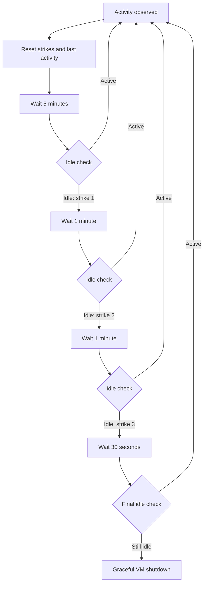

# SSH

- `serde`, `serde_derive`

## `local` feature

- Cargo feature, disabled by default and intended only for development.
- Allows everyone to create/start/stop/delete/list VMs through Elhone.
- Elhone must bind to a loopback address while `local` is enabled.
- Without `local`, unauthenticated Elhone requests return `403 Forbidden`.

# Module: Elhone

- `axum`
- Uses an `Arc<Barbirolli>`.
- Binds to `ELHONE_ADDR`, defaulting to `127.0.0.1:3000`; `local` rejects non-loopback values.
- JSON responses, including `{"error": "..."}` for errors.
- Unknown VMs return `404`, invalid state transitions return `409`, invalid input returns `422`,
  and internal lifecycle failures return `500`.
- Mutating operations on the same VM are serialized.

## DELETE `/vms/:id`

```http
DELETE /vms/:id
```

- Shuts down a running VM, cleans its resources, and removes its directory.
- Returns `204 No Content`; the directory is kept if cleanup fails.

## GET `/vms`

```http
GET /vms
```

```json
[
  {
    "id": 0,
    "status": "running",
    "port_bindings": [
      {
        "internal": 22,
        "external": 2222
      }
    ],
    "network": {
      "vm_id": 0,
      "tap": "fc-tap0",
      "subnet": "172.16.0.0",
      "host_ip": "172.16.0.1",
      "guest_ip": "172.16.0.2",
      "guest_mac": "06:00:ac:10:00:02"
    }
  }
]
```

## GET `/vms/:id/status`

```http
GET /vms/:id/status
```

```json
{ "id": 0, "status": "discovered" }
```

Statuses are `discovered`, `starting`, `running`, `shutting_down`, and `failed`.

## POST `/vms/:id/start`

```http
POST /vms/:id/start
```

- `200 OK` if already running, otherwise starts a discovered VM.

## POST `/vms/:id/shutdown`

```http
POST /vms/:id/shutdown
```

- `200 OK` if already discovered, otherwise performs graceful shutdown and cleanup.

## POST `/vms`

```http
POST /vms

{
  "vcpu_count": 2,
  "memory_mib": 1024,
  "authorized_keys": ["ssh-ed25519 ..."],
  "port_bindings": [
    {
      "internal": 22,
      "external": 2222
    }
  ]
}
```

- The service always copies `IMAGE_ROOT/vmlinux` and `IMAGE_ROOT/alpine.ext4`.
- Requests containing `kernel` or `rootfs` are invalid input.
- `port_bindings` uses `internal:external` semantics and publishes TCP only. For example,
  `{ "internal": 22, "external": 2222 }` forwards host TCP port 2222 to guest TCP port 22.
- Ports are nonzero `u16` values. External-port uniqueness is guaranteed by the provisioning
  design and is not revalidated here.
- Creates a VM and returns `201 Created` with its persisted numeric ID.

# Module: Barbirolli

- `fctools`
- `nlink`
- `validated`
- The first milestone owns persistence, Firecracker lifecycle, and VM networking.
- Support Firecracker 1.13 on x86_64 and aarch64 Linux; `FIRECRACKER` names its executable.
- Use `UnrestrictedVmmExecutor` initially. Jailer and cgroups are out of scope.

```rust
// to be used with Arc
struct Barbirolli {
    vms: dashmap::DashMap<VmId, Arc<Mutex<BarbirolliVm>>>,
    vm_root: PathBuf,
    image_root: PathBuf,
    firecracker: PathBuf,
    api_socket_timeout: Duration = Duration::from_secs(10),
    shutdown_timeout: Duration = Duration::from_secs(10),
}


/// deref, derefmut to VmSpec
enum BarbirolliVm {
    Discovered(VmSpec),
    Managed(ManagedVm),
}

impl Barbirolli {
    fn new(vm_root: PathBuf, image_root: PathBuf, firecracker: PathBuf) -> Result<Self>;

    fn create(&self, input: vm::Input) -> VmId;

    fn delete(&self, vm_id: VmId);

    fn vm(&self, vm_id: VmId) -> &mut BarbirolliVm // actually dashmap's mut ref
}

impl BarbirolliVm {
    fn start(&mut self) -> vm::Result {
        match self.take() {
            Self::Discovered(spec) => {
                *self = ManagedVm::start(spec)?;
            }
            Self::Managed(spec) => {
                *self = ManagedVm::start(spec.config)?;
            }
        }
    }
}
```

## Vm Specs

```rust
type Result<T, E = LifecycleError> = std::result::Result<T, E>;

/// Parsed in the range 0..16384 and persisted in config.json.
struct VmId(u16);

/// `VcpuCount`, `MemoryMib`, and `AuthorizedKey` parse their constraints during
/// deserialization.
struct VmSpec {
    vm_id: VmId,
    /// Defaults to false when absent from an older config.
    deleted: bool,
    artifact_dir: PathBuf,
    kernel: PathBuf,
    rootfs: PathBuf,
    vcpu_count: VcpuCount,
    memory_mib: MemoryMib,
    network: NetworkSpec,
}

struct VmConfig {
    spec: VmSpec,
    firecracker: PathBuf,
}

struct ManagedVm {
    vm: FirecrackerVm,
    spec: VmSpec,
    network: PreparedNetwork,
}

impl ManagedVm {
    fn start(config: VmConfig) -> Result<Self> {
        let network = config.spec.network.prepare_managed_network().await?;
        let mut vm = config.prepare().await.map_err(|err| {
            match (err, network.cleanup()) {
                // Combine errors
            }
        });
        match vm.start(config.api_socket_timeout).await {
            Ok(()) => Ok(Self {
                vm,
                spec: config.spec,
                network: Some(network),
            }),
            Err(err) => match (rollback(&mut vm, barbirolli.shutdown_timeout), network.cleanup(), err) {
                // combine errors
            },
        }
    }

    fn cleanup(&mut self) -> Result<()> {
        let vm = self.vm.cleanup().await;
        let network = match self.network.take() {
            Some(network) => network.cleanup().await,
            None => Ok(()),
        };
        match (vm, network) {
            (Ok(()), Ok(())) => Ok(()),
            (vm, network) => Err(LifecycleError::cleanup_failures(vm.err(), network.err())),
        }
    }

    /// if x86
    ///   curl --unix-socket "$API_SOCKET" -X PUT -H 'Content-Type: application/json' -d '{"action_type":"SendCtrlAltDel"}' \ http://localhost/actions
    /// if not
    ///   write to serial 'reboot\n'
    /// curl --unix-socket "$API_SOCKET" -X PUT -H 'Content-Type: application/json' -d '{"action_type":"Pause"}' \ http://localhost/actions
    /// kill -KILL "$pid"
    fn shutdown(&mut self) -> Result<fctools::vm::VmShutdownOutcome>;
}

type FirecrackerResourceSystem =
    fctools::vm::ResourceSystem<DirectProcessSpawner, TokioRuntime>;
type FirecrackerVm =
    fctools::vm::Vm<UnrestrictedVmmExecutor, DirectProcessSpawner, TokioRuntime>;

#[derive(Serialize, Deserialize)]
struct VmInput {
    vcpu_count: VcpuCount, // 1..=31
    memory_mib: MemoryMib, // 1..=2047
    authorized_keys: Vec<AuthorizedKey>,
    port_bindings: Vec<PortBinding>,
}

struct PortBinding {
    internal: Port,
    external: Port,
}

impl VmConfig {
    fn new(vm_id: VmId, input: VmInput) -> Result<Self>;

    fn prepare(&self) -> Result<FirecrackerVm> {
        let resources = FirecrackerResourceSystem::with_capacity(..);
        let config = firecracker_vm_config(&mut resources, self);

        FirecrackerVm::prepare(.., config)
    }
}

fn firecracker_vm_config(
    resources: &mut FirecrackerResourceSystem,
    spec: &VmSpec,
) -> Result<fctools::vm::VmConfiguration> {
    Ok(json!({
        "boot-source": {
            "kernel_image_path": spec.kernel,
            "boot_args": "keep_bootcon console=ttyS0 reboot=k panic=1"
        },
        "drives": [
            {
                "drive_id": "rootfs",
                "path_on_host": spec.rootfs,
                "is_root_device": true,
                "is_read_only": false
            }
        ],
        "machine-config": {
            "vcpu_count": spec.vcpu_count,
            "mem_size_mib": spec.memory_mib
        },
        "network-interfaces": [
            {
                "iface_id": "eth0",
                "host_dev_name": spec.network.tap_name,
                "guest_mac": spec.network.guest_mac
            }
        ]
    }))
}

enum LifecycleError {
    InvalidInput,
    NotFound,
    InvalidTransition,
    Storage,
    Network,
    Firecracker,
    StartupRollback,
    CleanupFailures,
}
```

The snippets are illustrative, but their ownership, state transitions, and error-preservation
behavior are normative. Startup rollback and cleanup must attempt every owned resource and retain
all failures.

## VM directory

- `VM_ROOT` holds VM directories and `IMAGE_ROOT` holds the fixed source artifacts.
- Filesystem operations follow normal OS behavior, including following symlinks. Missing or
  unusable paths fail through ordinary I/O errors.
- A VM gets the `VmId` equal to the number of persisted VM directories, starting at `0`. Deleted
  VM directories remain in that count, so IDs increase monotonically and are never reused.
- VM creation is serialized and built in a temporary directory, then atomically renamed.
- Each `$VM_ROOT/<vm_id>` contains:
  - `vmlinux`: copied from `IMAGE_ROOT/vmlinux`.
  - `rootfs.ext4`: private writable copy of `IMAGE_ROOT/alpine.ext4`.
  - `config.json`: versioned `VmSpec`, including the stable `VmId`, deletion marker, and port
    bindings.
- Deletion first shuts down the VM, then sets `deleted: true` in `config.json` and unregisters it.
  The VM directory, kernel, rootfs, and config remain on disk. There is currently no undelete,
  garbage collection, or artifact pruning.
- A nonempty `authorized_keys` request is written directly to
  `/root/.ssh/authorized_keys` inside the private ext4, with `0700` on `.ssh` and `0600` on the
  file. No key sidecar is written beside the VM artifacts.
- If no keys are supplied, leave intact the default key already embedded in the source image.
- `scripts/setup` installs that default key while preparing `IMAGE_ROOT/alpine.ext4`.

## Networking

```rust

fn default_host_interface() -> Result<InterfaceName>;

struct NetworkSpec {
    vm_id: VmId,
    tap_name: InterfaceName,
    subnet: Ipv4Addr,
    host_ip: Ipv4Addr,
    guest_ip: Ipv4Addr,
    guest_mac: String,
    api_socket: PathBuf,
}

impl NetworkSpec {
    /// One table is installed per VM in a single nlink transaction:
    ///
    /// table ip fc_vm_0 {
    ///     chain prerouting {
    ///         type nat hook prerouting priority dstnat;
    ///         policy accept;
    ///
    ///         # external 2222 -> internal 22
    ///         iifname "eth0" ip daddr != 172.16.0.0/16 tcp dport 2222 \
    ///             dnat to 172.16.0.2:22 comment "published-tcp-dnat"
    ///     }
    ///
    ///     chain forward {
    ///         type filter hook forward priority filter;
    ///         policy accept;
    ///
    ///         # Prevent this VM from reaching any VM subnet in 172.16.0.0/16.
    ///         iifname "fc-tap0" ip daddr 172.16.0.0/16 \
    ///             drop comment "vm-isolation"
    ///
    ///         # Allow the VM to send traffic through the host's external interface.
    ///         iifname "fc-tap0" oifname "eth0" \
    ///             accept comment "vm-egress"
    ///
    ///         # Allow return traffic belonging to existing VM connections.
    ///         iifname "eth0" oifname "fc-tap0" \
    ///             ct state established,related accept comment "vm-established"
    ///
    ///         # Allow only traffic DNAT translated for this published port.
    ///         iifname "eth0" oifname "fc-tap0" \
    ///             ip daddr 172.16.0.2 tcp dport 22 \
    ///             accept comment "published-tcp-forward"
    ///
    ///         # Default-deny all remaining forwarded traffic into this VM.
    ///         oifname "fc-tap0" drop comment "drop-unpublished-inbound"
    ///     }
    ///
    ///     chain postrouting {
    ///         type nat hook postrouting priority srcnat;
    ///         policy accept;
    ///
    ///         # Replace the VM's private source address with the host's eth0 address.
    ///         ip saddr 172.16.0.0/30 oifname "eth0" masquerade
    ///     }
    /// }
    fn install_nftables_rules(
        &self,
        conn: &Connection<Nftables>,
        host: &InterfaceName,
        table: &str,
        port_bindings: &[PortBinding],
    ) -> Result<()>;

    fn prepare_managed_network(
        &self,
        port_bindings: &[PortBinding],
    ) -> Result<PreparedNetwork> {
        let nft_table = format!("fc_vm_{}", self.vm_id);
        // Create TAP, enable forwarding, and atomically install nftables rules.
    }
}

struct InterfaceName(String);

impl TryFrom<&str> for InterfaceName {
    type Error = NetworkError;

    fn try_from(s: &str) -> Result<Self> {
        let is_valid = !s.is_empty()
            && s.len() <= 15
            && s
                .bytes()
                .all(|byte| byte.is_ascii_alphanumeric() || b"_.-".contains(&byte));
        if is_valid {
            Ok(s.into())
        } else {
            Err(NetworkError::InvalidInterface(s.to_owned()))
        }
    }
}
```

- Allocate 2^14 `/30` networks from `172.16.0.0/16`: network, host, guest, broadcast.
- Fail startup if the pool overlaps an existing host route.
- Select the lowest-metric IPv4 default route in the main routing table.
- Publish every binding as TCP from the host's selected default interface to the VM guest address.
- Permit established replies and configured published ports into a VM; deny all other forwarded
  inbound traffic to that VM's TAP.
- Keep each base-chain policy at `accept` because every VM owns an independent table. The final
  output-TAP-specific drop supplies default deny without one VM's base chain dropping another VM's
  packets.
- Exclude `172.16.0.0/16` destinations from DNAT. After one table translates a packet into the VM
  pool, later per-VM prerouting chains cannot translate it again when an internal port happens to
  equal another VM's external port.
- Allow unrestricted VM internet egress and established replies; deny VM-to-VM traffic.
- IPv6, guest-to-host isolation, and egress filtering are out of scope.
- IPv4 forwarding is shared host state and remains enabled after per-VM cleanup.
- Guest static IP, gateway, and DNS configuration must be written before boot.

```rust
impl VmNetworkSpec {
    fn new(vm_id: VmId) -> Result<Self> {
        let tap_name = format!("fc-tap{vm_id}");
        let offset = vm_id * 4;
        let x = (offset / 256) as u8;
        let y = (offset % 256) as u8;
        let z = y + 2;

        Ok(VmNetworkSpec {
            vm_id,
            tap_name: InterfaceName::try_from(tap_name.as_str())?,
            subnet: 172.16.x.y.,
            host_ip: 172.16.x.(y + 1),
            guest_ip: 172.16.x.z,
            guest_mac: 06:00:ac:10:{x:02x}:{z:02x},
        })
    }

    fn subnet_cidr(&self) -> SString;
}
```

## Lifecycle

### Warmup

The application reads and parses every VM directory in `VM_ROOT` and fails startup on malformed
configuration. Configurations marked `deleted: true` still count toward future ID allocation but
are not reconciled or registered. For every active VM, warmup reconciles stale Firecracker
processes, sockets, TAPs, and nftables tables and registers it as `BarbirolliVm::Discovered`. VMs
are not started automatically.

### Shutdown

Stop accepting lifecycle operations, attempt graceful shutdown and cleanup for every managed VM,
and return all failures after every VM has been attempted. Graceful shutdown uses Ctrl-Alt-Del on
x86_64 and `reboot\n` on aarch64, followed by pause-and-kill and kill fallbacks.

## Observability

- Use `tracing` and a formatted `tracing_subscriber`.
- `RUST_LOG` controls filtering, with `info` as the fallback.
- Log HTTP method/path/status/latency and every VM state transition with `vm_id` and operation.
- Startup rollback, cleanup, warmup reconciliation, and shutdown failures must never be silent.
- Never log authorized keys, credentials, or request bodies containing secrets.

# Code Style

- Illegal states shouldn't be representable. Parsing > validating.
- If you need to repeat code 2 times, copy and paste, it's better for readability, if more than 2
  or 3 times, think before copying and pasting
- Host networking and Firecracker API operations use Rust libraries, not `ip`, `nft`, or `curl`
  subprocesses. Launching Firecracker itself is expected.

## Idle detection and automatic shutdown

Each running VM is sampled at the Firecracker boundary. CPU, memory, and process usage come from
the VM's cgroup; network and disk byte counters come from Firecracker's metrics FIFO; connection
state comes from conntrack entries involving the guest IP. Memory is reported but does not count
as activity. CPU above its configured threshold, network or disk traffic, a process-count change,
or any established TCP connection resets the idle timer.

```text
cpu_percent =
    100 * delta_usage_usec
        / (interval_usec * vcpu_count)

cpu_threshold =
    idle_high + 0.2 * (active_low - idle_high)
```

The default `idle_high` is `0.5%` and `active_low` is `3.0%`, producing a `1.0%` threshold.



The timing and CPU bands are configurable with `IDLE_INITIAL_INTERVAL_SECONDS`,
`IDLE_STRIKE_INTERVAL_SECONDS`, `IDLE_FINAL_INTERVAL_SECONDS`, `IDLE_CPU_HIGH_PERCENT`, and
`IDLE_CPU_LOW_PERCENT`. The first sample and any regressed counter establish a new baseline.
- Every crate must be a member of the root Cargo workspace.
- The application runs only on Linux, but production code must remain visible to rust-analyzer on
  macOS. Do not hide it behind `#[cfg(target_os = "linux")]`.

## `flake.nix`

- `flake.nix` is the development-toolchain source of truth for macOS and Linux.
- Pin `nixpkgs` to `nixos-26.05`; use `rust-overlay`, `flake-utils`, and `git-hooks.nix`.
- Load Rust from `rust-toolchain.toml` and provide nightly rustfmt, pre-commit, `just`, and Lima in
  the default development shell.
- Enable the rustfmt pre-commit check and set `RUST_BACKTRACE=1`.
- `nix develop` provides the editor/tooling environment; Firecracker and KVM execution stays
  inside Linux or Lima.
- `nix flake check` must pass.

## Testing

- Use `cargo-mutants` for meaningful business and lifecycle logic.
- Avoiding unit testing that only improves coverage
- Cover API state transitions, concurrent operations, restart discovery, rollback, cleanup, address
  allocation, network isolation, and one complete privileged Firecracker lifecycle.

```rust
#[firecracker_test]
fn bla_test() {}
```

Every test that queries the Firecracker API uses this macro from `barbirolli_derive`. The macro
supports tests, allocates a unique VM ID, and serializes privileged tests:

```
if linux && kvm && firecracker && artifacts {
  // run test
} else if RUN_ON_LIMA {
  // run test on lima
} else {
  panic!("install the missing Firecracker prerequisites or enable `RUN_ON_LIMA`")
}
```

Required checks are formatting, Clippy with warnings denied, workspace tests, `cargo-mutants`, and
the ignored privileged tests on Linux/Lima.
