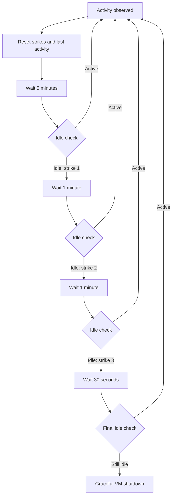

# SSH VM service

## Architecture

Elhone is the HTTP service and Barbirolli is the owner of VM state.

# Elhone: HTTP boundary

Named after [Harry MacElhone](https://en.wikipedia.org/wiki/Harry_MacElhone), a bartender in
early-twentieth-century New York.

- Built with `axum` around an `Arc<Barbirolli>`.
- Binds to `ELHONE_ADDR`, defaulting to `127.0.0.1:3000`; `local` rejects non-loopback values.
- JSON responses, including `{"error": "..."}` for errors.
- Unknown VMs return `404`, invalid state transitions return `409`, invalid input returns `422`,
  and internal lifecycle failures return `500`.
- Mutating operations on the same VM are serialized.

## DELETE `/vms/:id`

```http
DELETE /vms/:id
```

Shuts down the VM, cleans its runtime resources, persists the deletion marker, and returns
`204 No Content`. If shutdown or cleanup fails, deletion stops and the VM remains registered.

## GET `/vms`

```http
GET /vms
```

```json
[
  {
    "id": 0,
    "status": "running",
    "port_bindings": [{ "internal": 22, "external": 2222 }],
    "network": {
      "vm_id": 0,
      "tap": "fc-tap0",
      "subnet": "172.16.0.0",
      "host_ip": "172.16.0.1",
      "guest_ip": "172.16.0.2",
      "guest_mac": "06:00:ac:10:00:02"
    }
  }
]
```

Returns the state, port bindings, and allocated network of every registered VM. States are
`discovered`, `starting`, `running`, `shutting_down`, and `failed`.

## GET `/vms/:id/status`

```http
GET /vms/:id/status
```

```json
{ "id": 0, "status": "discovered" }
```

## POST `/vms/:id/start`

```http
POST /vms/:id/start
```

Starts a discovered VM. Starting an already running VM succeeds without changing it.

## POST `/vms/:id/shutdown`

```http
POST /vms/:id/shutdown
```

Gracefully shuts down a managed VM and cleans its runtime resources. Shutting down a discovered
VM succeeds without changing it.

## POST `/vms`

```http
POST /vms

{
  "vcpu_count": 2,
  "authorized_keys": ["ssh-ed25519 ..."],
  "port_bindings": [{ "internal": 22, "external": 2222 }]
}
```

Creates a stopped VM and returns `201 Created` with its ID. Kernel and rootfs paths are not part
of the request; the service copies both artifacts from `IMAGE_ROOT`. Memory is selected by the
daemon's provisioning configuration (256 MiB by default) and persisted in `VmSpec`; it is not a
per-request input. Ports are nonzero `u16` values. A binding
`{ "internal": 22, "external": 2222 }` publishes host TCP port `2222` as guest port `22`.
External-port uniqueness is a provisioning invariant.

# Barbirolli: VM and host-resource boundary

Named after [Sir John Barbirolli](https://en.wikipedia.org/wiki/John_Barbirolli), the British
conductor associated with [The Hallé](https://en.wikipedia.org/wiki/The_Hall%C3%A9).

- `fctools`
- `nlink`
- `validated`
- Barbirolli owns persistence, the Firecracker lifecycle, and VM networking.
- Barbirolli supports Firecracker 1.13 on x86_64 and aarch64 Linux; `FIRECRACKER` names its
  executable.
- Firecracker runs through `UnrestrictedVmmExecutor`; jailer support is out of scope.
- Each running VM has one cgroup v2 directory for health and idle sampling.

```rust
struct Barbirolli {
    vms: DashMap<VmId, BarbirolliVm>,
    store: VmStore,
    firecracker: Firecracker,
    balloon: RwLock<Balloon>,
    provisioning: ProvisioningConfig,
    shutdown_timeout: Duration,
    draining: AtomicBool,
    idle_policy: IdlePolicy,
}

struct Firecracker {
    bin: PathBuf,
    api_socket_timeout: Duration,
}

struct DaemonConfig {
    provisioning: ProvisioningConfig,
    firecracker: PathBuf,
    idle_policy: Option<IdlePolicy>,
}

struct ProvisioningConfig {
    default_vm_mem: MemoryMib,
    max_daemon_mem: MemoryMib,
    initial_ballon_mem: MemoryMib,
    count: u32,
    extra_percentage: u8,
}

enum BarbirolliVm {
    /// Persisted and stopped. Owns no runtime resources.
    Discovered(VmSpec),
    /// The last lifecycle operation failed. Owns no runtime resources.
    Failed(VmSpec),
    /// Running, or retaining resources after a failed cleanup.
    Managed(ManagedVm),
}

/// Owns the resources of a running VM.
struct ManagedVm {
    spec: VmSpec,
    vm: FirecrackerVm,
    network: Option<ManagedNetwork>,
    pid: i32,
    cgroup: Option<VmCgroup>,
    metrics_task: JoinHandle<()>,
    latest_metrics: Arc<RwLock<Option<Metrics>>>,
    monitor: Mutex<Option<Monitor>>,
    failed: bool,
}
```

## VM types and state

```rust
type Result<T, E = LifecycleError> = std::result::Result<T, E>;

/// Parsed in the range 0..16384 and persisted in config.json.
struct VmId(u16);

struct VmSpec {
    id: VmId,
    /// Defaults to false when absent from a config.
    deleted: bool,
    artifact_dir: PathBuf,
    kernel: PathBuf,
    rootfs: PathBuf,
    vcpu_count: VcpuCount,
    api_socket: ApiSocket,
    memory_mib: MemoryMib,
    port_bindings: Vec<PortBinding>,
    network: NetworkSpec,
}

type FirecrackerResourceSystem = fctools::vm::ResourceSystem<...>;
type FirecrackerVm = fctools::vm::Vm<...>;

#[derive(Serialize, Deserialize)]
struct VmInput {
    vcpu_count: VcpuCount, // 1..=31
    authorized_keys: Vec<AuthorizedKey>,
    port_bindings: Vec<PortBinding>,
}

struct PortBinding {
    internal: Port,
    external: Port,
}

struct ApiSocket(PathBuf);

enum LifecycleError {
    InvalidInput,
    NotFound,
    InvalidTransition,
    Storage,
    Network,
    Firecracker,
    StartupRollback,
    CleanupFailures,
}
```

## Persistence

Each `$VM_ROOT/<vm_id>` contains:

- `vmlinux`: copied from `IMAGE_ROOT/vmlinux`.
- `vmlinux.config`: the pinned kernel config fragment installed by `scripts/setup_daemon`.
- `rootfs.ext4`: private writable copy of `IMAGE_ROOT/alpine.ext4`.
- `config.json`: versioned `VmSpec`.

- `VM_ROOT` holds VM directories and `IMAGE_ROOT` holds the fixed source artifacts.
- Every persisted `VmSpec` owns its unique Firecracker API socket path under
  `$VM_ROOT/.sockets`; runtime cleanup removes the socket file without discarding that path.
- A VM gets the `VmId` equal to the number of persisted VM directories, starting at `0`. Deleted
  VM directories remain in that count, so IDs increase monotonically and are never reused.
- A nonempty `authorized_keys` request is written directly to
  `/root/.ssh/authorized_keys` inside the private ext4, with `0700` on `.ssh` and `0600` on the
  file. No key sidecar is written beside the VM artifacts.
- With no supplied keys, the rootfs keeps the default key embedded in the source image.
- `scripts/setup_daemon` installs that default key while preparing `IMAGE_ROOT/alpine.ext4`.

## Host and guest networking

```rust

fn default_host_interface() -> Result<InterfaceName>;

struct NetworkSpec {
    vm_id: VmId,
    tap_name: InterfaceName,
    subnet: Ipv4Addr,
    host_ip: Ipv4Addr,
    guest_ip: Ipv4Addr,
    guest_mac: String,
}

enum FirewallRule {
    Dnat { external_port: Port, guest_ip: Ipv4Addr, internal_port: Port },
    DropVmToVm,
    AllowVmEgress,
    AllowEstablishedToVm,
    AllowPublishedTcp { guest_ip: Ipv4Addr, internal_port: Port },
    DropUnpublishedInbound,
    MasqueradeVmSubnet,
}

impl NetworkSpec {
    fn install_nftables_rules(
        &self,
        conn: &Connection<Nftables>,
        host: &InterfaceName,
        table: &str,
        port_bindings: &[PortBinding],
    ) -> Result<()>;

    fn prepare_managed_network(
        &self,
        port_bindings: &[PortBinding],
    ) -> Result<PreparedNetwork> {
        let nft_table = format!("fc_vm_{}", self.vm_id);
        // Create the TAP, enable forwarding, and install the per-VM nftables table.
    }
}

struct InterfaceName(String);

impl TryFrom<&str> for InterfaceName {
    type Error = NetworkError;

    fn try_from(s: &str) -> Result<Self> {
        let is_valid = !s.is_empty()
            && s.len() <= 15
            && s
                .bytes()
                .all(|byte| byte.is_ascii_alphanumeric() || b"_.-".contains(&byte));
        if is_valid {
            Ok(s.into())
        } else {
            Err(NetworkError::InvalidInterface(s.to_owned()))
        }
    }
}
```

- The `172.16.0.0/16` pool provides 2^14 `/30` networks. Each contains a network address, host
  address, guest address, and broadcast address.
- Startup fails if the pool overlaps an existing host route.
- The lowest-metric IPv4 default route in the main routing table supplies the external interface.
- Every binding publishes TCP from the selected external interface to the VM guest address and
  permits peer VMs to reach the same internal TCP port directly.
- Established replies and published ports can enter a VM from the host or a peer VM. All other
  forwarded traffic to its TAP is denied.
- Each base-chain policy remains `accept` because every VM owns an independent table. The final
  output-TAP-specific drop supplies default deny without one VM's base chain dropping another VM's
  packets.
- DNAT excludes `172.16.0.0/16`. Once a table translates a packet into the VM pool, another VM's
  table cannot translate it again because its internal port matches another external port.
- VM to VM communication is dropped, while internet egress packets are allowed
- IPv6, guest-to-host isolation, and egress filtering are out of scope.
- IPv4 forwarding is shared host state and remains enabled after per-VM cleanup.
- Guest static IP, gateway, and DNS configuration are present before boot.

```rust
impl VmNetworkSpec {
    fn new(vm_id: VmId) -> Result<Self> {
        let tap_name = format!("fc-tap{vm_id}");
        let offset = vm_id * 4;
        let x = (offset / 256) as u8;
        let y = (offset % 256) as u8;
        let z = y + 2;

        Ok(VmNetworkSpec {
            vm_id,
            tap_name: InterfaceName::try_from(tap_name.as_str())?,
            subnet: 172.16.x.y.,
            host_ip: 172.16.x.(y + 1),
            guest_ip: 172.16.x.z,
            guest_mac: 06:00:ac:10:{x:02x}:{z:02x},
        })
    }

    fn subnet_cidr(&self) -> SString;
}
```

## Lifecycle and reconciliation

### Creation

Creation provisions a stopped VM.

```rust
async fn create(&self, input: VmInput) -> Result<VmId> {
    self.is_app_alive()?;
    let spec = self
        .store
        .create(input, self.provisioning.default_vm_mem)
        .await?;
    let id = spec.id;
    self.vms.insert(id, BarbirolliVm::Discovered(spec));
    Ok(id)
}
```

### Starting a VM

Starting replaces `Discovered(VmSpec)` with `Managed(ManagedVm)`.

```rust
async fn start(&mut self, barbirolli: &Barbirolli) -> Result<()> {
    let spec = match self {
        Self::Discovered(spec) => spec.clone(),
        Self::Failed(spec) => {
            spec.reconcile(barbirolli).await?;
            spec.clone()
        }
        Self::Managed(vm) if vm.failed => return Err(InvalidTransition),
        Self::Managed(_) => return Ok(()),
    };

    match ManagedVm::start(spec.clone(), barbirolli).await {
        Ok(managed) => {
            *self = Self::Managed(managed);
            Ok(())
        }
        Err(error) => {
            *self = Self::Failed(spec);
            Err(error)
        }
    }
}
```

The start sequence is:

1. Barbirolli prepares the TAP, routes, addresses, forwarding, and nftables table.
2. `fctools` builds the Firecracker resources and configuration.
3. Firecracker starts and opens its API socket.
4. Barbirolli finds the Firecracker PID.
5. Barbirolli creates `/sys/fs/cgroup/barbirolli/vm-<id>` and moves the PID into it.
6. The metrics reader starts.
7. `ManagedVm` takes ownership of the live resources.

```rust
async fn ManagedVm::start(spec: VmSpec, barbirolli: &Barbirolli) -> Result<Self> {
    let network = spec.network.prepare(&spec.port_bindings).await?;
    let mut vm = spec.prepare_vm(barbirolli).await
        .map_err(|error| rollback_network(error, &network))?;

    vm.start(barbirolli.firecracker.api_socket_timeout).await
        .map_err(|error| rollback_vm_and_network(error, &mut vm, &network))?;

    let pid = find_firecracker_pid(barbirolli, &spec).await
        .map_err(|error| rollback_vm_and_network(error, &mut vm, &network))?;

    let cgroup = VmCgroup::create(spec.id.to_string(), pid)
        .map_err(|error| rollback_vm_and_network(error, &mut vm, &network))?;

    let latest_metrics = Arc::new(RwLock::new(None));
    let metrics_task = spawn_metrics_reader(spec.metrics_path(), latest_metrics.clone());

    Ok(Self {
        spec,
        vm,
        network: Some(network),
        pid,
        cgroup: Some(cgroup),
        metrics_task,
        latest_metrics,
        monitor: Mutex::new(None),
        failed: false,
    })
}
```

The cgroup is created after Firecracker starts because it needs the spawned PID. Failures after
network preparation trigger rollback of every acquired resource. The returned error includes both
the startup failure and any rollback failures.

### Shutting down a VM

Shutdown releases runtime resources but keeps the persisted VM. A successful shutdown always ends
in `Discovered(VmSpec)`.

```rust
async fn shutdown(&mut self, barbirolli: &Barbirolli) -> Result<()> {
    match self {
        Self::Discovered(_) => Ok(()),
        Self::Failed(spec) => {
            spec.reconcile(barbirolli).await?;
            *self = Self::Discovered(spec.clone());
            Ok(())
        }
        Self::Managed(managed) => {
            let shutdown = managed.shutdown(barbirolli.shutdown_timeout).await;
            let cleanup = managed.cleanup().await;

            match (shutdown, cleanup) {
                (Ok(()), Ok(())) => {
                    *self = Self::Discovered(managed.spec.clone());
                    Ok(())
                }
                (shutdown, cleanup) => {
                    managed.failed = true;
                    Err(ShutdownCleanup { shutdown, cleanup })
                }
            }
        }
    }
}
```

`ManagedVm::shutdown` sends Ctrl-Alt-Del on x86_64 or writes `reboot\n` to the serial console on
aarch64. On timeout it falls back to pause-and-kill, then kill. Cleanup separately stops the
metrics reader and removes the Firecracker resources, network, and cgroup. All cleanup branches
run even when one fails.

### Deletion

Deletion runs the normal shutdown path, writes `deleted: true` to `config.json`, and removes the VM
from the in-memory map. The VM directory remains on disk and its ID is never reused.

```rust
async fn delete(&self, vm_id: VmId) -> Result<()> {
    self.is_app_alive()?;
    let mut vm = self.vms.entry(vm_id).occupied_or(NotFound)?;

    vm.get_mut().shutdown(self).await?;
    self.store.delete(vm.get().spec())?;
    vm.remove();

    Ok(())
}
```

### Warmup and recovery

At startup Barbirolli reads every versioned config. Active VMs are reconciled and registered as
`Discovered`; deleted VMs only count toward ID allocation. No VM starts automatically.

```rust
/// kills all processe stale processes on the application startup, stale
/// nftables, cgroup, etc, to be read into a
async fn reconcile(&self, barbirolli: &Barbirolli) -> Result<()> {
    Validated::from(self.kill_stale_processes(barbirolli).await)
        .map4(
            Validated::from(self.network.cleanup_stale().await),
            Validated::from(self.remove_stale_api_socket()),
            Validated::from(self.cleanup_stale_health()),
            |(), (), (), ()| (),
        )
        .into_result()
}
```

### Application shutdown

Application shutdown sets `draining`, rejects new operations, and shuts down every registered VM.
One failure does not stop the remaining shutdowns; Barbirolli returns all failures at the end.

## Idle detection and automatic shutdown

Each running VM is sampled at the Firecracker boundary. CPU, memory, and process usage come from
the VM's cgroup; network and disk byte counters come from Firecracker's metrics FIFO; connection
state comes from conntrack entries involving the guest IP. Memory is reported but does not count
as activity. CPU above its configured threshold, network or disk traffic, a process-count change,
or any established TCP connection resets the idle timer.

```text
cpu_percent =
    100 * delta_usage_usec
        / (interval_usec * vcpu_count)

cpu_threshold =
    idle_high + 0.2 * (active_low - idle_high)
```

The default `idle_high` is `0.5%` and `active_low` is `3.0%`, producing a `1.0%` threshold.



The timing and CPU bands are configurable with `IDLE_INITIAL_INTERVAL_SECONDS`,
`IDLE_STRIKE_INTERVAL_SECONDS`, `IDLE_FINAL_INTERVAL_SECONDS`, `IDLE_CPU_HIGH_PERCENT`, and
`IDLE_CPU_LOW_PERCENT`. The first sample and any regressed counter establish a new baseline.

## Testing

- `cargo-mutants` exercises meaningful business and lifecycle logic.
- Unit tests exist to verify behavior rather than only to increase coverage.
- The test suite covers API state transitions, concurrent operations, restart discovery, rollback,
  cleanup, address allocation, network isolation, and one complete privileged Firecracker
  lifecycle.

```rust
#[firecracker_test]
fn bla_test() {}
```

Every test that queries the Firecracker API uses this macro from `barbirolli_derive`. The macro
allocates a unique VM ID and serializes privileged tests. It runs locally when Linux, KVM,
Firecracker, and the image artifacts are available; otherwise `RUN_ON_LIMA` reruns the selected
test inside Lima.
